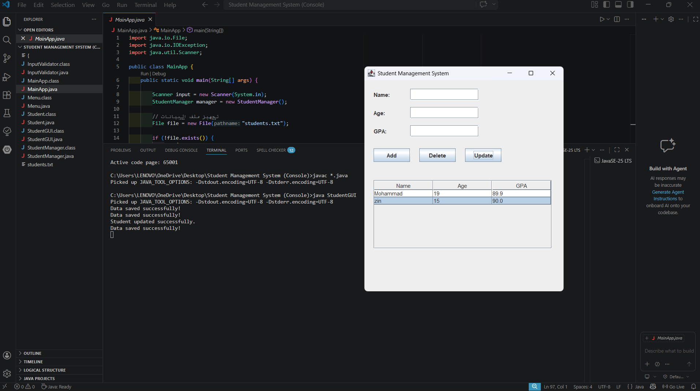

# 🎓 Student Management System (Java)

A simple Student Management System built using Java.
The application allows you to manage student records with a clean GUI interface.

---

## 🚀 Features

* ✅ Add Student
* ❌ Prevent duplicate student names
* 🔍 Search Student
* 🗑️ Delete Student
* ✏️ Update Student
* 📊 Sort students by GPA
* 💾 Save data to file
* 📂 Load data automatically on startup
* 🖥️ GUI using Java Swing

---

## 🛠️ Technologies Used

* Java
* Java Swing (GUI)
* File Handling (File, Scanner, FileWriter)
* ArrayList
* OOP Principles

---

## 📁 Project Structure

```
StudentManagementSystem/
│
├── MainApp.java
├── Student.java
├── StudentManager.java
├── InputValidator.java
├── Menu.java
├── StudentGUI.java
├── .gitignore
└── README.md
└── screenshot1.png
```

---

## ▶️ How to Run

### 1. Compile the project

```bash
javac *.java
```

### 2. Run GUI version

```bash
java StudentGUI
```

### 3. Run Console version (optional)

```bash
java MainApp
```

---

## 📌 Notes

* The file `students.txt` is **auto-created** when the program runs.
* It is not included in the repository intentionally.

---

## 👨‍💻 Author

Mohammad

---

## ⭐ Future Improvements

* Add better UI design
* Use JavaFX instead of Swing
* Connect to a database (MySQL)
* Add login system

---

## 💡 Screenshot


